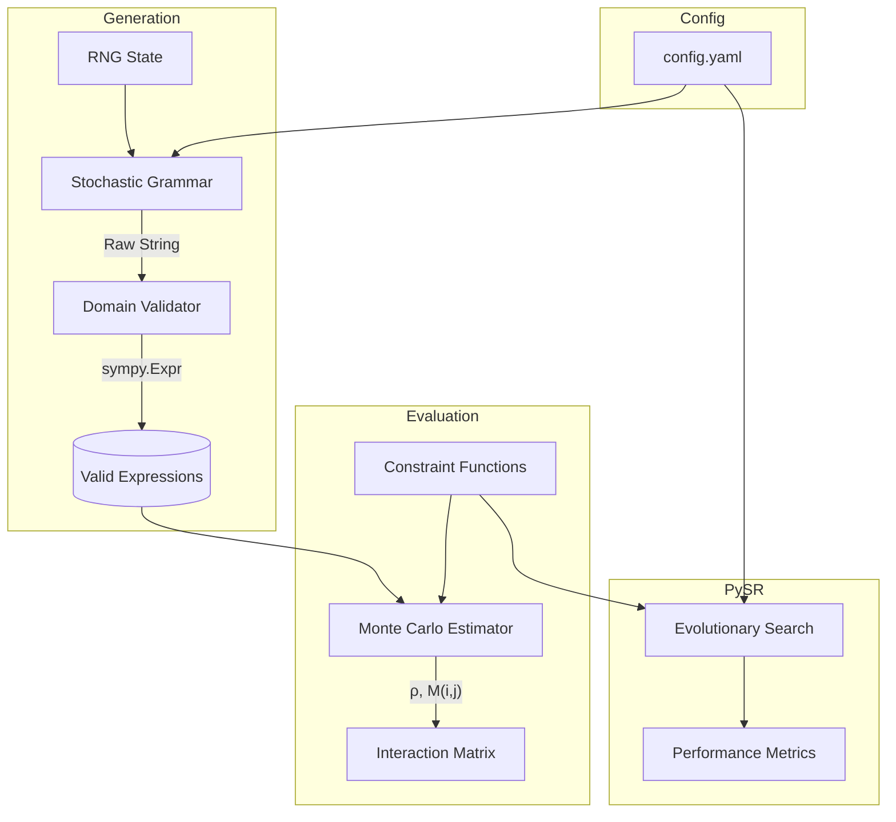

# Architecture Overview

This document provides a high-level overview of the `Constraint-Interaction-SymREG` framework, explaining its design, data flow, and key abstractions. It is designed to help new contributors understand how the system is built and how data moves through it.

## System Design

The framework is composed of four primary subsystems:
1. **Generator**: Stochastic grammar-based expression construction.
2. **Constraints**: Mathematical/structural condition evaluators.
3. **Metric**: Monte Carlo estimators for $\rho(C)$ and $M(i,j)$.
4. **Experiments**: Integration with PySR for search dynamic benchmarking.



## Directory Structure

```text
Constraint-Interaction-SymREG/
├── config.yaml            # Single source of truth for all parameters
├── docs/                  # Documentation
│   ├── API.md             # Public API reference
│   ├── ARCHITECTURE.md    # This file
│   ├── DESIGN_CONTEXT.md  # Formal mathematical specification and invariants
│   └── LOGBOOK.md         # Daily project logbook
├── results/               # Auto-created; benchmark and run outputs (JSON)
├── src/                   # Core Python modules
│   ├── expr_generator.py  # Generation subsystem ✓
│   ├── metric.py          # Monte Carlo estimator ✓
│   ├── constraints.py     # Constraint evaluation logic (Planned)
│   └── experiments.py     # PySR integration (Planned)
└── tests/                 # Unit tests (mirrors src/ structure)
    ├── test_expr_generator.py  ✓ (16 tests)
    └── test_metric.py          ✓ (15 tests + 2 doctests)
```

## Data Flow: Monte Carlo Density Estimation

The primary data flow for calculating the interaction metric $M(i,j)$ follows these steps:

1. **Initialization**: `GrammarGenerator` loads grammar parameters and seeds from `config.yaml`.
2. **Sampling**: `DensityEstimator.estimate()` calls `generator.reset_stats()`, then draws exactly `N` valid SymPy expressions via `generate_sympy()`, retrying silently on any `None` return. Transparency into draw attempts is via `generator.stats['generated']`.
3. **Validation Pass**: Performed inside the generator on each draw — expressions that fail numeric domain probing (`_validate_domain`) are rejected and replaced. Counted in `stats['domain_rejected']`.
4. **Constraint Checking**: A single pass over the collected expression list evaluates every `C_i(expr)` and every pair `(C_i, C_j)` in O(N·k²) total comparisons (DESIGN_CONTEXT §8).
5. **Density Calculation**: `rho_i = n_i / N` and `rho_ij = n_ij / N` are returned in a `RhoResult` dataclass.
6. **Interaction Matrix**: `InteractionMatrix.compute()` fills the upper triangle from `rho_ij`, then **explicitly mirrors** to the lower triangle to guarantee M[i][j] == M[j][i]. Zero-density pairs are set to `NaN`, not a crash (DESIGN_CONTEXT §6.3).
7. **Confidence Intervals**: `BootstrapCI.compute()` resamples the expression list B=1000 times using the percentile method. The `grammar_config` dict can be passed for §9 reproducibility snapshotting.

## Key Design Decisions

### 1. Separation of Parse and Probe (`expr_generator.py`)
**Decision**: We use `sympify(evaluate=False)` followed by a numeric probe (`_validate_domain`).
**Reasoning**: If we let SymPy evaluate expressions during parsing, it automatically simplifies them (e.g., `x + x` becomes `2*x`), destroying the original structural AST that our constraints need to inspect. However, `evaluate=False` hides domain errors (like `1/0`). A separate numeric probing pass gives us the best of both worlds: intact ASTs and mathematically sound expressions.

### 2. Config-Driven Randomness
**Decision**: The generator maintains its own isolated `random.Random` state seeded from `config.yaml`.
**Reasoning**: Relying on the global Python `random` module causes reproducibility issues when integrating with large external libraries like PySR or SciPy, which might alter the global seed. Isolated state ensures that generating exactly $N$ expressions always yields the exact same outputs.

### 3. Stratified Depth Generation
**Decision**: Implementing `generate_at_depth(target_depth)` instead of purely uniform generation.
**Reasoning**: A pure stochastic process rarely reaches deep trees (e.g., depth 8) due to the cumulative probability of early leaf returns. Stratified sampling guarantees uniform representation across all depths, which is crucial for unbiased density estimations.

## Extension Points

- **Adding New Operators**: Modify the `grammar` section of `config.yaml`. The generator automatically adapts.
- **Adding New Constraints**: Implement a pure function `C(expr) -> bool` in `constraints.py`. No changes to `metric.py` needed — `DensityEstimator.estimate()` accepts any list of callables.
- **Modifying the Grammar Process**: To change how expressions are structurally built, inherit from `GrammarGenerator` and override the `_generate_recursive` and `_generate_exact_depth` methods.
- **Custom Bootstrap**: Subclass `BootstrapCI` and override `compute()`. Pass `grammar_config=generator.config` to embed grammar metadata in reproducibility logs per DESIGN_CONTEXT §9.
