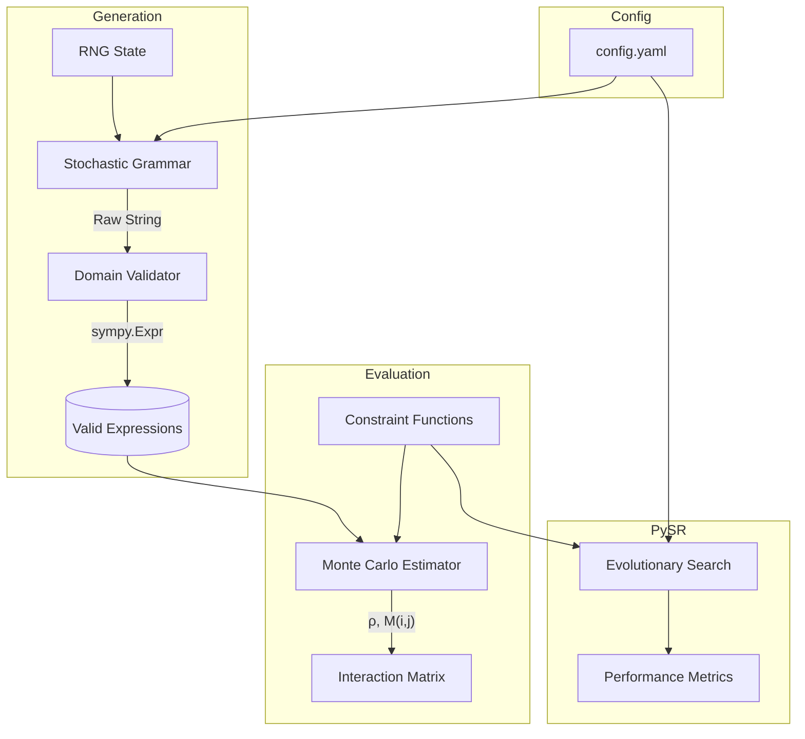

# Architecture Overview

This document provides a high-level overview of the `Constraint-Interaction-SymREG` framework, explaining its design, data flow, and key abstractions. It is designed to help new contributors understand how the system is built and how data moves through it.

## System Design

The framework is composed of four primary subsystems:
1. **Generator**: Stochastic grammar-based expression construction.
2. **Constraints**: Mathematical/structural condition evaluators.
3. **Metric**: Monte Carlo estimators for $\rho(C)$ and $M(i,j)$.
4. **Experiments**: Integration with PySR for search dynamic benchmarking.



## Directory Structure

```text
Constraint-Interaction-SymREG/
├── config.yaml            # Single source of truth for all parameters
├── docs/                  # Documentation
│   ├── API.md             # Public API reference
│   ├── ARCHITECTURE.md    # This file
│   └── DESIGN_CONTEXT.md  # Formal mathematical specification and invariants
├── src/                   # Core Python modules
│   ├── expr_generator.py  # Generation subsystem
│   ├── constraints.py     # Constraint evaluation logic (Planned)
│   ├── metric.py          # Monte Carlo estimator (Planned)
│   └── experiments.py     # PySR integration (Planned)
└── tests/                 # Unit tests (mirrors src/ structure)
```

## Data Flow: Monte Carlo Density Estimation

The primary data flow for calculating the interaction metric $M(i,j)$ follows these steps:

1. **Initialization**: `GrammarGenerator` loads constraints and seeds from `config.yaml`.
2. **Stratified Sampling**: `generator.generate_stratified()` produces $N$ valid SymPy expressions distributed evenly across specific target depths.
3. **Validation Pass**: The generator internally tests each expression numerically. If an expression causes a math domain error (e.g., division by zero, complex infinity), it is rejected, and a new one is drawn.
4. **Constraint Checking**: The `metric.py` module passes each valid expression through constraint functions $C_i(E)$ and $C_j(E)$.
5. **Density Calculation**: The total number of expressions satisfying the constraints is divided by $N$ to estimate $\rho(C_i)$, $\rho(C_j)$, and the joint probability $\rho(C_i \wedge C_j)$.
6. **Interaction Matrix**: The final coefficient $M(i,j)$ is computed and logged.

## Key Design Decisions

### 1. Separation of Parse and Probe (`expr_generator.py`)
**Decision**: We use `sympify(evaluate=False)` followed by a numeric probe (`_validate_domain`).
**Reasoning**: If we let SymPy evaluate expressions during parsing, it automatically simplifies them (e.g., `x + x` becomes `2*x`), destroying the original structural AST that our constraints need to inspect. However, `evaluate=False` hides domain errors (like `1/0`). A separate numeric probing pass gives us the best of both worlds: intact ASTs and mathematically sound expressions.

### 2. Config-Driven Randomness
**Decision**: The generator maintains its own isolated `random.Random` state seeded from `config.yaml`.
**Reasoning**: Relying on the global Python `random` module causes reproducibility issues when integrating with large external libraries like PySR or SciPy, which might alter the global seed. Isolated state ensures that generating exactly $N$ expressions always yields the exact same outputs.

### 3. Stratified Depth Generation
**Decision**: Implementing `generate_at_depth(target_depth)` instead of purely uniform generation.
**Reasoning**: A pure stochastic process rarely reaches deep trees (e.g., depth 8) due to the cumulative probability of early leaf returns. Stratified sampling guarantees uniform representation across all depths, which is crucial for unbiased density estimations.

## Extension Points

- **Adding New Operators**: Modify the `grammar` section of `config.yaml`. The generator automatically adapts.
- **Adding New Constraints**: Implement a pure function `C(expr) -> bool` in `constraints.py`.
- **Modifying the Grammar Process**: To change how expressions are structurally built, inherit from `GrammarGenerator` and override the `_generate_recursive` and `_generate_exact_depth` methods.
